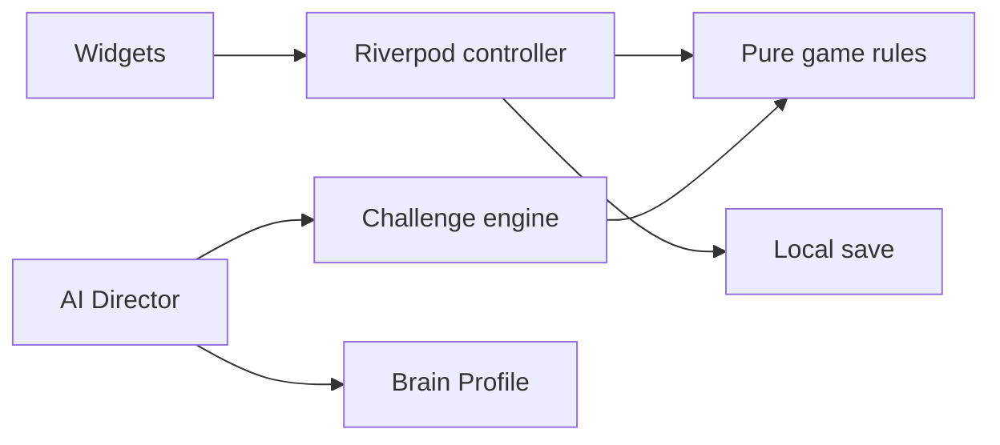

# Architecture overview

MindTrap AI is a small feature-first Flutter app. M0 owns rendering, input, deterministic round generation, local progress, and presentation state. Supabase is introduced later only for accounts, competition, economy, purchases, and remote configuration.

## M0 dependency flow

Widgets do not contain game rules. Rules do not import Flutter or vendor SDKs. Controllers own feature state and coordinate explicit collaborators. A feature may use another feature's public model/controller only when the current task needs it; it never reaches into another feature's storage implementation.

## M0 boundaries

- `app`: app bootstrap, router, and theme.
- `core`: only shared deterministic primitives and bundled configuration.
- `features/gameplay`: challenge contract, modules, session controller, and gameplay UI.
- `features/brain_profile`, `features/ai_director`, `features/progression`: pure rules plus their small UI/controller surfaces.
- `shared`: reusable UI only after two real uses.

Do not create repository interfaces, DTOs, service locators, generic result wrappers, or empty architecture layers in M0. Add a data boundary when a feature first talks to a real local or remote system.

## Data authority

Classic rounds are generated and resolved locally. A round records seed, challenge/config/policy version, parameters, timestamps, and outcome. Local state is a versioned save document. Later server paths are authoritative for competition, currency, inventory, and purchases; they use idempotent operation IDs.

## Failure behavior

Gameplay has a bundled configuration and does not wait for a network. Resolution freezes input once. A local-save failure never changes a visible result into a duplicate reward; it surfaces a recoverable failure. Later network errors use stable safe messages and retry only idempotent work.

## Testing and delivery

Task prompts state the smallest required checks. Test deterministic rules with injected time/seed, interaction with widget tests, and add one local-session integration smoke test at the M0 exit gate. CI, backend migrations, remote configuration, and store rollout are later work described in their own documents.
