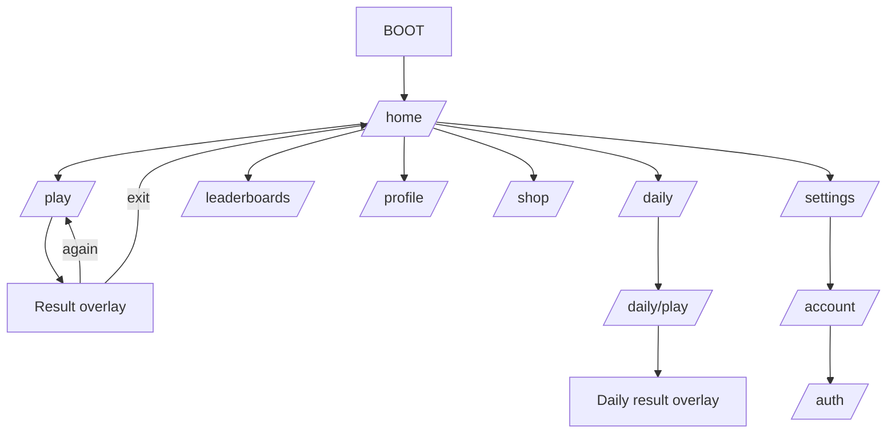

# Navigation

## Route graph

## Rules

- M0 has only Home and Gameplay routes. Splash, onboarding, settings, and every networked route are added in their assigned later slice.
- Splash decides only bootstrap readiness; it is not a timed marketing screen.
- Home is the stable root. System back from a root destination returns Home; back from Home backgrounds/exits according to platform convention.
- Gameplay blocks accidental back with a confirm-exit sheet only after a round is active. Backgrounding follows round lifecycle rules.
- Results are state within the gameplay route, not a separate pushed page, enabling sub-500 ms retry.
- Authentication is deferred until a cloud/competitive/account action requires it. Guest Classic play is never gated.
- Auth completion returns to the initiating route. Failed/canceled auth preserves guest state.
- Deep links initially support daily challenge and account recovery; unknown/expired links land on Home with a message.
- GoRouter redirects depend only on bootstrap/auth state and must not trigger API calls.

## Route ownership

`app/router.dart` owns paths, names, parsing, redirects, and navigator keys. Each feature exports its screen builder and typed argument model. Avoid passing domain objects through route extras; pass stable IDs or use feature state.

## Analytics

Track normalized screen views plus explicit navigation intent where it answers a product question. Do not emit duplicate screen views from rebuilds.
