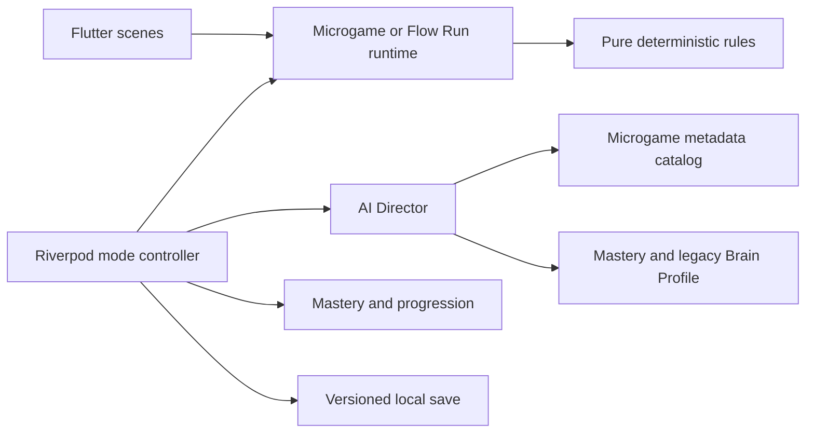

# Architecture overview

MindTrap AI remains a feature-first Flutter app using Riverpod and GoRouter. The repath is an incremental migration: preserve deterministic/local foundations, add a v2 microgame runtime beside the legacy challenge contract, migrate the main session, then remove the legacy main path only after compatibility and play validation.

## Target dependency flow

Widgets render immutable state and translate touch/semantic intent. Pure Dart generators, validators, reducers, physics, scoring, and failure explanations own rules. Runtime controllers own phase, monotonic time, ordered input, pause/abandon, and one terminal result. Mode/session controllers own run sequence, lives, score, progression coordination, and persistence. Navigation remains in GoRouter/UI only.

## Repath boundaries

- `app`: bootstrap, router, semantic themes, settings application.
- `features/gameplay`: shared microgame v2 contracts/runtime, legacy challenge compatibility, Troll Gauntlet controller and UI.
- `features/gameplay/microgames/<id>`: pure rules plus one scene adapter per game.
- `features/flow_run`: shared deterministic runner physics/segments, Calm and Rush controllers/scenes.
- `features/ai_director`: pure catalog selection and difficulty/modifier policy.
- `features/brain_profile`, `progression`, `cosmetics`: local pure models/controller surfaces; legacy data remains compatible.
- `core`: clock/random/config/persistence primitives only.
- `shared`: design-system UI or feedback services after central ownership is justified.

Do not introduce a physics engine, game engine, code generation, generic repository layer, service locator, second state/navigation package, or online AI dependency without a task and ADR proving need. Flutter widgets/custom painting are sufficient until profiling or mechanics prove otherwise.

## State and lifecycle ownership

Each active mode has one Riverpod controller and one runtime clock source. A runtime accepts input only in its declared phase, resolves idempotently, and reports one result. The mode controller applies score/profile/progression/persistence once using stable operation IDs. Backgrounding stops ticking immediately. Competitive/active Gauntlet state is abandoned or resumed only by an explicit tested rule; Calm may pause. No controller may infer elapsed background time from wall clock and silently advance gameplay.

Task 015 added lifecycle ownership to `GameplayScreen` and `GameSessionController`, but its widget/manual verification is incomplete. Preserve that implementation until v2 integration provides equivalent tests; do not assume it is release-proven.

## Determinism and configuration

Use namespaced seed derivation for run, selection, round, modifier, mechanic, and cosmetic presentation. Store microgame/modifier/config/policy versions with outcomes. Gameplay motion derives from injected monotonic elapsed time. Bundled validated config always supports core play; remote config may later tune bounded shipped parameters but never download executable Dart.

## Persistence compatibility

Current local save schema v1 stores Brain Profile, progression, and up to ten recent outcomes and rejects module IDs outside the legacy enum. Task 057 owns a versioned additive v1-to-v2 migration. It must:

- decode and retain every valid v1 field;
- default new mastery, mode bests, and currently consumed settings;
- preserve legacy outcome identifiers or archive them in a typed compatibility field;
- write v2 only after successful in-memory migration;
- keep corrupt/unsupported recovery explicit and non-destructive;
- test v1 fixtures, v2 round trip, failed writes, caps, deduplication, and defaults.

No earlier task changes the save schema. If v2 requirements expand before Task 057, update the migration task rather than adding ad hoc keys.

## Existing work classification

| Area | Action | Boundary |
|---|---|---|
| Flutter/Riverpod/GoRouter and feature-first layout | **Keep** | unchanged |
| injected clock, seeded random, bundled config validation | **Keep/Adapt** | add namespaced streams and v2 config; no rewrite |
| challenge contract and five legacy modules | **Migrate/Defer** | primary-route coexistence only through Task 056; preserve pure tests/IDs for compatibility |
| session/lifecycle/result flow | **Adapt** | split runtime from Gauntlet run ownership |
| AI Director | **Adapt** | retain deterministic policy seam; replace enum/category coupling |
| Brain Profile, XP, levels | **Migrate** | preserve data; subordinate presentation to mastery |
| local save | **Migrate** | additive schema v2 in Task 057 only |
| generic Material/card-heavy UI | **Replace/Restyle** | preserve semantics/navigation/state behavior |
| Supabase/daily/leaderboard/purchase roadmap | **Defer** | not active until local product validation |
| old Classic main-session path | **Remove** | Task 061 after Task 056 cutover proof |

## Failure behavior

Invalid plans never enter play. Generation retries once with a known-safe eligible plan, then ends safely without score/life/reward mutation. Resolution freezes rules input once. Persistence failure keeps the visible result and queues no unbounded retry. Later network work retries only idempotent operations and cannot block local modes.

## Testing seams

Pure rules receive injected seed/time/viewport/accessibility inputs. Contract and modifier tests cover repeatability and fairness invariants; widget tests cover pointer translation, semantics, and shared state presentation; controller tests cover run policy and idempotent updates; migration tests use frozen v1 fixtures. Manual gates cover physical touch/lifecycle, tell recognition, one-handed reach, reduced motion, light/dark, large text, audio-off, low-end performance, and first-session comprehension.
