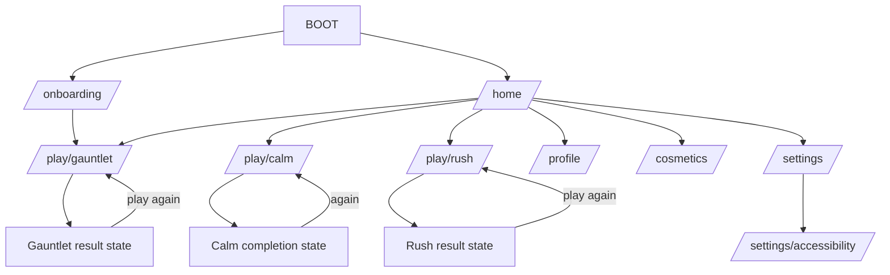

# Navigation

## Route graph

## Rules

- Home is the stable root. One prominent action enters Troll Gauntlet from launch.
- Gameplay modes are full-screen routes with no persistent bottom navigation.
- Results remain state inside each gameplay route so replay is under 500 ms.
- Back from active scored play uses one lightweight pause/leave sheet; result/inactive state exits normally.
- Calm Run supports explicit pause/resume without score pressure. App lifecycle follows each mode's documented policy.
- Bottom sheets are limited to lightweight mode details, settings choices, or exit confirmation. Do not add nested menus.
- GoRouter owns paths and parsing; redirects depend only on bootstrap/onboarding/account state and do not perform I/O.
- Guest local play is never gated by authentication. Cloud/account/deep-link routes remain deferred.

## Transition vocabulary

- Hierarchy movement uses one spatial slide/fade.
- Modal content uses one scale/fade.
- Home-to-mode may use a shared Trapling/object transition after performance validation.
- Microgame changes are quick scene replacements; runner segments transition spatially in-world.
- Results use controlled expansion. Reduced motion substitutes fades/state changes.

## Route ownership

`app/router.dart` owns route names, paths, redirects, and navigator keys. Features export screen builders and stable argument models. Pass mode/run IDs or read feature state; do not pass mutable domain objects through route extras. Navigation never originates in storage, game rules, or vendor SDK models.
